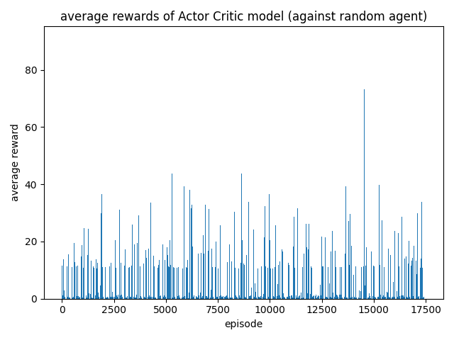
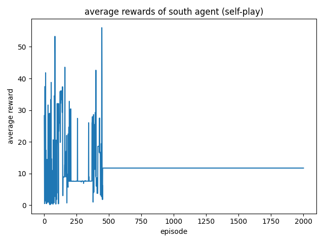
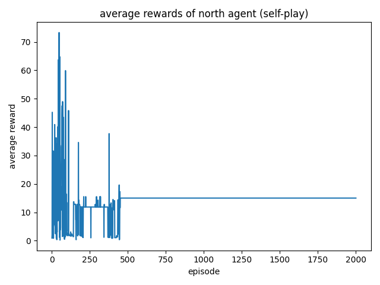
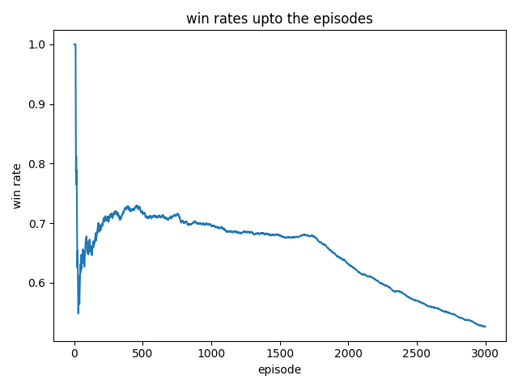
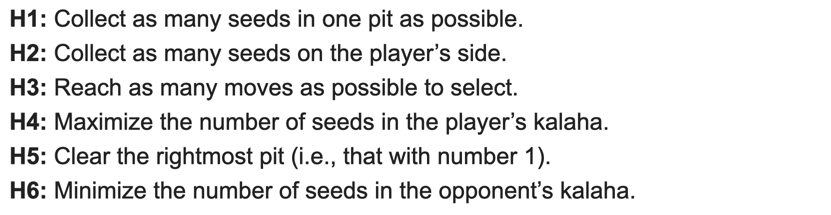

## Training
### self-play (without policy search)

plots |
--- |
|

### against `RandomAgent`

plots |
--- |
| 
|

---

## debugging the model
so, I've changed:
- layer width: 128 -> 32
- eliminated the shared layer
- don't make any clones

and this is the result: 

the win rate increases from 0-500 episodes.
But from that point, it drops.
what if increase the number of layers?

now, let's adopt the rewards from the heuristics here:
